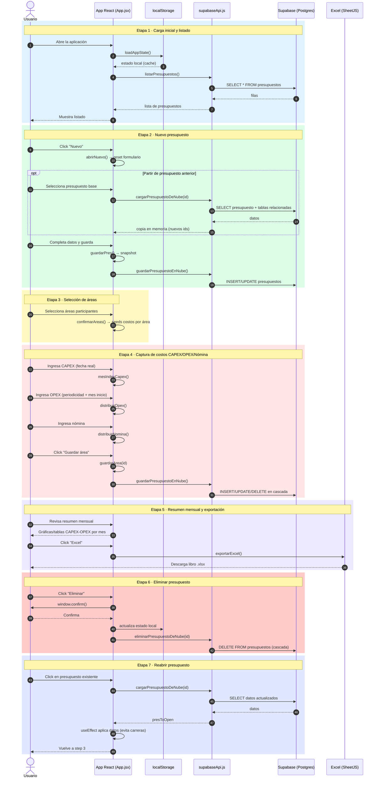

# Diagrama de secuencia — Flujo de trabajo del proyecto

Este diagrama documenta el flujo end-to-end de la aplicación (React SPA + Supabase), desde la carga inicial del listado de presupuestos hasta la exportación a Excel, eliminación y reapertura de un presupuesto.

Cada etapa está coloreada para facilitar su identificación:

- 🔵 Etapa 1 — Carga inicial y listado
- 🟢 Etapa 2 — Nuevo presupuesto
- 🟡 Etapa 3 — Selección de áreas
- 🔴 Etapa 4 — Captura de costos CAPEX/OPEX/Nómina
- 🟣 Etapa 5 — Resumen mensual y exportación a Excel
- 🟥 Etapa 6 — Eliminar presupuesto
- 🔷 Etapa 7 — Reabrir presupuesto

